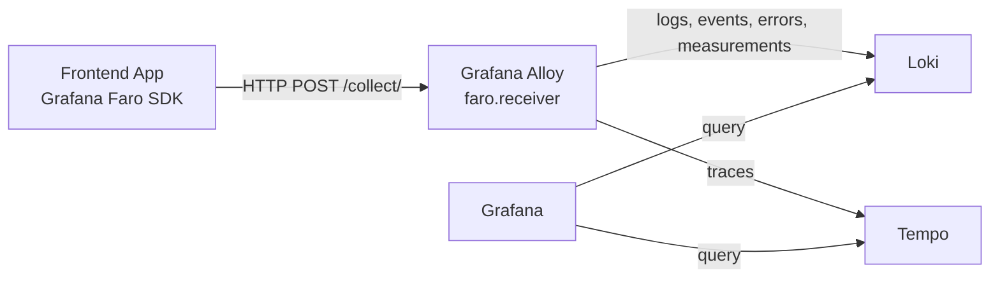

# Local Grafana Faro Stack

This folder gives you a self-hosted Grafana Faro stack plus a small multi-page
Next.js demo app for proving browser metrics, errors, network timings, and trace
propagation.

## What is included

- `Grafana Alloy`: receives browser telemetry through `faro.receiver`
- `Loki`: stores logs, events, measurements, and errors emitted by Faro
- `Tempo`: stores traces emitted by Faro tracing instrumentation
- `Grafana`: pre-provisioned with Loki and Tempo data sources
- `frontend/faro-showcase`: a Next.js demo app on port `3001`

## Observability flow



Signal routing in this stack:

- logs, events, errors, and measurements go to `Loki`
- traces go to `Tempo`
- `Grafana` reads from both so you can inspect the full browser signal flow

## What you need for Faro locally

For a basic OSS Faro pipeline you need:

1. A frontend app with the Faro SDK.
2. A collector endpoint that accepts Faro payloads. In this setup that is Alloy's `faro.receiver`.
3. Loki for log-like signals.
4. Tempo for traces.
5. Grafana to explore the data.

You do not need Mimir or Prometheus just to get started with browser Faro signals in OSS. Those are useful if you also want broader metrics storage, but the Faro receiver itself forwards logs to Loki and traces to Tempo.

## Start the stack

From the repository root:

```bash
docker compose up -d
```

## Run the demo app

In a second terminal:

```bash
cd frontend/faro-showcase
npm install
npm run dev
```

## URLs

- Grafana: `http://localhost:3000`
- Demo app: `http://localhost:3001`
- Alloy UI: `http://localhost:12345`
- Alloy Faro receiver: `http://localhost:12347/collect`
- Loki API: `http://localhost:3100`
- Tempo API: `http://localhost:3200`
- Tempo OTLP HTTP: `http://localhost:4318/v1/traces`

Grafana credentials:

- user: `admin`
- password: `admin`

## What to point your frontend at

The demo app is already configured to send browser Faro data to:

```text
http://localhost:12347/collect
```

If you build another frontend, `<your-app-name>` can be any stable slug such as
`storefront` or `dashboard-web`.

If your frontend runs on another origin during development, the current Alloy config will still accept it because `cors_allowed_origins = ["*"]` is enabled for local setup. Tighten that before exposing this stack outside local development.

## Minimal frontend snippet

An example Faro initialization file is available at [snippets/faro-init.ts](/Users/ayush/VisualStudioProjects/testing-setup/frontend/snippets/faro-init.ts).

## Demo routes

- `/web-vitals`: mirrors Next.js web vitals into Faro custom measurements
- `/status-errors`: emits handled JS errors, console errors, unhandled rejections, and HTTP 503s
- `/network-waterfall`: surfaces DNS, TCP, TLS, TTFB, and resource timing
- `/trace-lab`: creates one browser parent span with nested child spans and a traced server request

The demo app also exports server spans directly to Tempo over OTLP HTTP on port
`4318`, which lets the `/trace-lab` route verify that the browser trace ID and
server trace ID match.

## Where to look in Grafana

1. Go to `Explore`.
2. Select the `Loki` data source and start with:

```logql
{job="faro-web"}
```

3. Try focused queries such as:

```logql
{job="faro-web"} |= "next.web_vital"
```

```logql
{job="faro-web"} |= "browser.navigation.timings"
```

```logql
{job="faro-web", kind="error"}
```

4. Switch to the `Tempo` data source and search for:

```text
journey.parent
```

or

```text
api.telemetry.demo
```

Those span names are emitted by the `/trace-lab` flow and the traced API route.

## If your app is not containerized

Nothing special is required. If your app runs directly on your machine, the
browser can still post to `http://localhost:12347`.

## If your app is containerized later

Your browser code should still post to the host port that the browser can reach. In most local setups that is still `http://localhost:12347`, not `http://alloy:12347`.

## Optional next additions

- tighten Alloy CORS to your actual frontend origin
- add Faro sourcemap resolution once your build output location is known
- add dashboards tailored to your app labels

## Important limitation

This is a self-hosted OSS Faro pipeline. It gives you browser telemetry in Loki and Tempo inside Grafana.

It does not reproduce the full Grafana Cloud Frontend Observability product UI. That richer product experience is Grafana Cloud specific.
